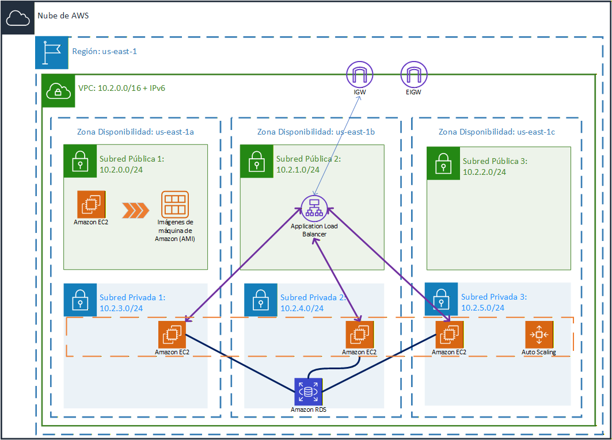
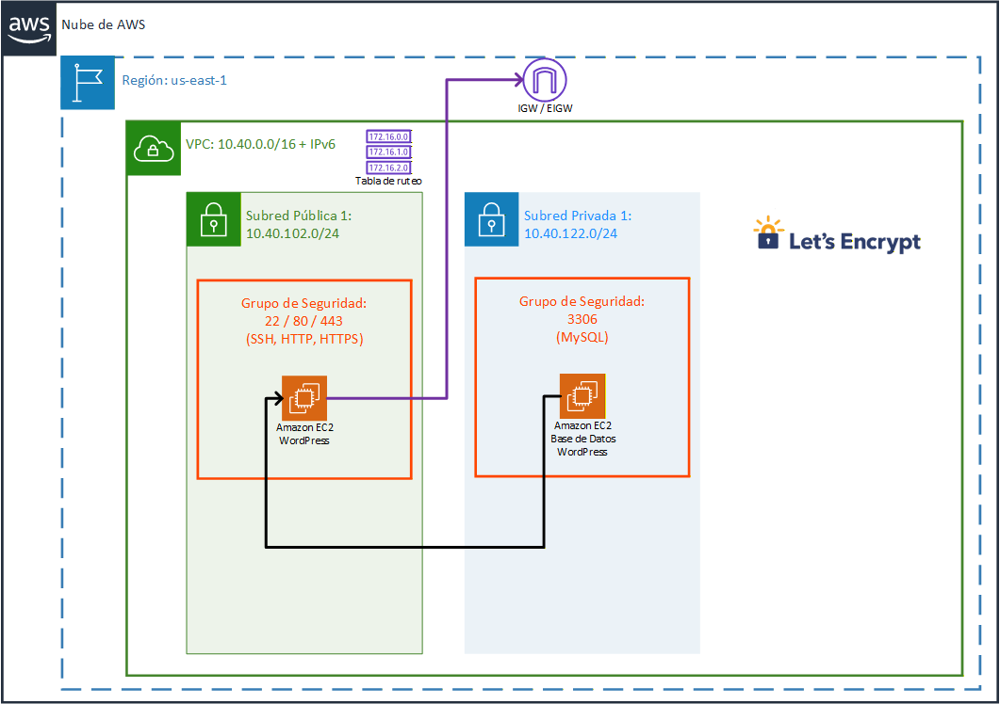
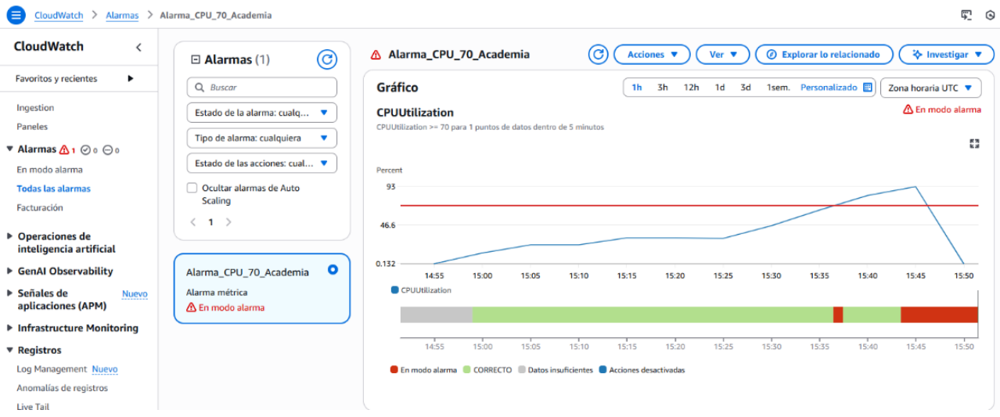

# 🎨 AWS Cloud Infrastructure: Academia de Pintura (RetaCantabria 2025)

##  Introduccion del Proyecto
Este proyecto nace bajo el marco del reto RetaCantabria 2025, con el objetivo de diseñar y desplegar una infraestructura Cloud robusta para una Academia de Pintura. La solución no es simplemente una migración al buscador, sino una arquitectura diseñada bajo los principios de Alta Disponibilidad, Escalabilidad y Seguridad Perimetral.

Utilizando Infraestructura como Código (IaC) mediante CloudFormation, se ha orquestado un entorno DualStack (IPv4/IPv6) que integra servicios de computación elástica (EC2/ASG), bases de datos gestionadas (RDS con soporte para Triggers) y una capa de automatización Serverless (Lambda/SNS) para la gestión inteligente de backups.

## 🏗️ Recursos de AWS Utilizados 

| Icono | Servicio AWS | Categoría | Función en el Proyecto |
| :---: | :--- | :--- | :--- |
|  | **VPC** | Networking | Segmentación de red con subredes públicas y privadas. |
|  | **EC2** | Computación | Hosting de la aplicación PHP y WordPress (Glosario). |
|  | **ELB & ASG** | Escalabilidad | Balanceador de carga y auto-escalado para alta disponibilidad. |
|  | **RDS (MySQL)** | Base de Datos | Base de Datos relacional gestionada para la app principal. |
|  | **S3** | Almacenamiento | Destino de backups diarios automatizados vía cron. |
|  | **Lambda** | Automatización | Ejecución de código sin servidores para tareas programadas. |
|  | **CloudFormation** | IaC | Despliegue automático de recursos mediante plantillas YAML. |
|  | **SNS** | Mensajería | Servicio sencillo de notificaciones y alertas. |
|  | **CloudWatch** | Monitorización | Monitorización y observabilidad de todo el sistema cloud. |

La arquitectura de red sigue una segmentación estricta para proteger los recursos sensibles aqui esta mi estructura:

Subredes públicas: en esta capa residen el balanceador de carga (alb) y los puntos de acceso a internet (igw), gestionando la entrada de tráfico de los usuarios.

Subredes privadas: es el entorno seguro donde se alojan las instancias ec2 y la base de datos rds, quedando totalmente aisladas del acceso directo desde internet.

Security groups: he configurado reglas de cortafuegos a medida para permitir únicamente el tráfico necesario, abriendo los puertos 80 y 443 para la navegación web y el puerto 3306 para las comunicaciones internas de la base de datos mysql.

<table align="center">
  <tr>
    <td align="center">
      
       
      <b>Interfaz Aplicación PHP</b>
    </td>
    <td align="center">
      
       
      <b>Glosario WordPress</b>
    </td>
  </tr>
</table>

## Base de datos gestionada (RDS)

Para la persistencia de datos he utilizado rds con el motor mysql, lo que permite delegar las tareas de mantenimiento y parcheo a aws. la base de datos está ubicada exclusivamente en subredes privadas, protegida por grupos de seguridad que solo permiten el tráfico interno desde los servidores de aplicaciones.

##  Almacenamiento (S3)
No solo almacenamos datos, los gestionamos eficientemente:
* **Triggers Automatizados:** Implementación de lógica en la base de datos para el archivado automático de inscripciones en la tabla `_archivadas` antes de su eliminación física.
* **Ciclo de Vida de Backup:** 1. `Cron job` local realiza `mysqldump`.
    2. Envío cifrado a **S3**.
    3. Notificación **SNS** al administrador sobre el estado de la copia.
  
  
## Automatización serverless (Lambda  SNS )

 
 
 
Disparador (trigger): la función lambda se activa automáticamente cada vez que se detecta un nuevo archivo de backup en el bucket de s3.

Lógica de notificación: el script de python procesa el evento y utiliza sns (simple notification service) para enviar una alerta inmediata al equipo de administración.

ventaja técnica: este modelo elimina la necesidad de tener un servidor encendido solo para vigilar los backups, reduciendo costes y mejorando la eficiencia del sistema.

El administrador tendra constantemente feedback mediante SNS de los backups asignados.

##  Seguridad y Administración
Como administrador del sistema, implementé las siguientes mejoras de seguridad y eficiencia:
- **Backup Automation:** Implementación de `cron jobs` para copias de seguridad diarias en **S3**.
- **Acceso Seguro:** Gestión de accesos mediante claves SSH personalizadas y despliegue de firewall mediante Grupos de Seguridad.
- **Base de Datos Robusta:** Uso de **Triggers** para el archivado automático de registros (`_archivadas`), garantizando la integridad de los datos históricos.

---
## Análisis de Costes (FinOps)
El proyecto ha sido diseñado para operar dentro del **AWS Free Tier** durante la fase de desarrollo. 
- **Right-sizing:** Uso de instancias de la familia `t3` (arquitectura Nitro).
- **Monitorizacion: Monitorizacion mediante ClodWatch
- **Políticas de S3:** Ciclo de vida para transicionar backups antiguos a *Glacier* y minimizar costes de almacenamiento persistente.
- **Optimizacion de costes: Para consultar el análisis financiero detallado 

Para consultar el análisis financiero detallado:

---

---
##  Monitorización y alertas (cloudwatch)

  

Para garantizar la estabilidad del sistema, he configurado una alarma en cloudwatch que supervisa el uso de los recursos en tiempo real. 

La alarma_cpu_70_academia se activa automáticamente si la utilización de la cpu supera el 70 por ciento durante un intervalo de 5 minutos. este umbral actúa como el disparador para que el grupo de autoescalado añada servidores de forma dinámica, evitando la saturación de la web durante picos de tráfico.

Comprobe su correcta funcionalidad con un estres de la CPU al 100% en la EC2

*Este proyecto forma parte del reto RetaCantabria 2025 - I.E.S. Alisal.*

---

